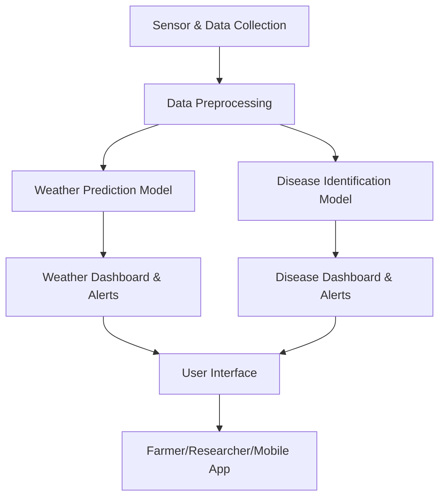

# Architecture Overview

## Smart Agriculture: Weather Prediction and Disease Identification

This document provides an overview of the architecture for the Smart Agriculture and Weather Prediction and Disease Identification system. The architecture is designed for modularity, scalability, and real-world deployment in agricultural environments.

---

## 🏗️ High-Level Architecture

---

### 1. Data Collection Layer

- **IoT Sensors & Devices:**  
  Collect real-time environmental data (temperature, humidity, soil moisture, etc.) from the field.
- **Satellite & External APIs:**  
  Fetch additional weather, soil, and crop data.

### 2. Data Preprocessing Layer

- **Cleaning & Normalization:**  
  Raw data is cleaned, normalized, and formatted for modeling.
- **Feature Engineering:**  
  Extract relevant features for weather and disease prediction.

### 3. Prediction Layer

- **Weather Prediction Module (Python/C++):**  
  Utilizes machine learning (e.g., regression, time-series analysis) for forecasting.
- **Disease Identification Module (Python/C++):**  
  Employs computer vision (CNNs) to detect diseases from leaf images.

### 4. Visualization & Alerting Layer

- **Dashboards (Jupyter Notebook/Python Web):**  
  Visualize predictions, historical data, and trends.
- **Automated Alerts:**  
  Notify users about adverse weather or disease outbreaks.

### 5. User Interface Layer

- **Web/Mobile Application:**  
  Interactive interface for farmers and researchers to view data, receive alerts, and upload images.

---

## 🗂️ Technology Stack

- **Python:** Core logic, ML/DL models, and REST API (if applicable)
- **C++/C/Cython:** Performance-critical components and native extensions
- **Jupyter Notebook:** Data analysis, visualization, and model prototyping
- **IoT Devices:** Arduino, Raspberry Pi, or similar for sensor integration
- **Machine Learning:** scikit-learn, TensorFlow, Keras, OpenCV
- **Web/Mobile (Optional):** Flask/Django (Python), React/Flutter

---

## 📦 Modular Components

- `src/weather/`: Weather prediction logic and models
- `src/disease/`: Crop disease identification logic and models
- `data/`: Datasets and sensor data
- `models/`: Saved ML/DL models
- `notebooks/`: Experimentation and visualization

---

## 🔄 Data Flow

1. **Data Ingestion:**  
   Sensors and APIs send data to the server.
2. **Preprocessing:**  
   Data is cleaned and features are extracted.
3. **Model Inference:**  
   Models process the data for prediction or classification.
4. **Result Delivery:**  
   Results and alerts are sent to dashboards and user devices.

---

## 🛡️ Extensibility & Scalability

- Modular codebase allows for easy addition of new sensors, crops, or regions.
- Cloud integration possible for large-scale deployments.
- RESTful APIs can allow integration with third-party platforms.

---

## 📈 Example Data Flow for Disease Identification

1. Farmer uploads a leaf image via mobile/web app.
2. Image is preprocessed and sent to the disease identification model.
3. Model predicts disease (if any) and sends result back to the user.
4. Dashboard updates with new case and recommendations.

---

## 🔗 Integration Points

- **APIs:** For connecting with external weather and agri-data providers.
- **Database:** (Optional) To store historical weather, disease, and user data.
- **Cloud:** For scalability and remote access, if needed.

---

> This architecture ensures a robust, scalable, and user-friendly platform for smart agriculture and proactive crop management.
